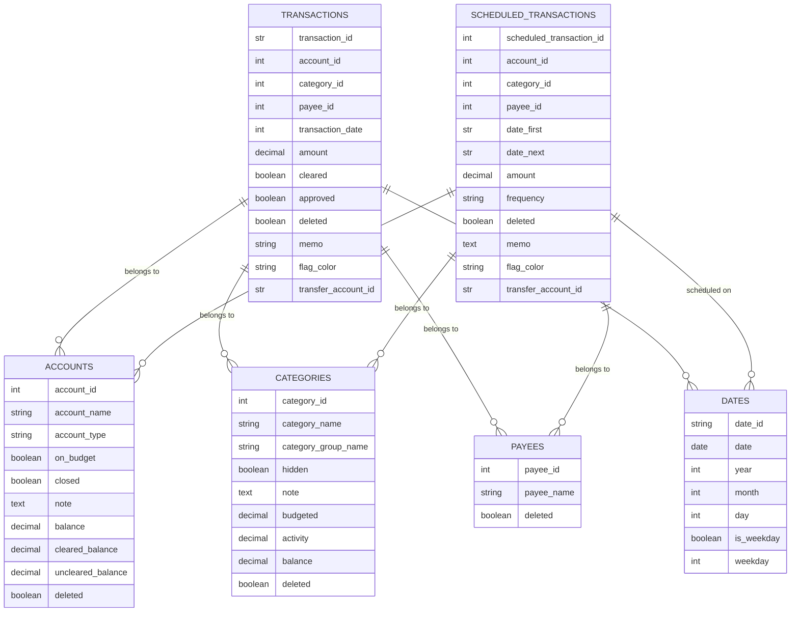

# ERD for the dimensional model

```mermaid
erDiagram
    ACCOUNTS {
        int account_id
        string account_name
        string account_type
        boolean on_budget
        boolean closed
        text note
        decimal balance
        decimal cleared_balance
        decimal uncleared_balance
        boolean deleted
    }
    
    CATEGORIES {
        int category_id
        string category_name
        string category_group_name
        boolean hidden
        text note
        decimal budgeted
        decimal activity
        decimal balance
        boolean deleted
    }
    
    PAYEES {
        int payee_id
        string payee_name
        boolean deleted
    }
    
    DATES {
        string date_id
        date date
        int year
        int month
        int day
        boolean is_weekday
        int weekday
    }
    
    TRANSACTIONS {
        str transaction_id
        int account_id
        int category_id
        int payee_id
        int transaction_date
        decimal amount
        boolean cleared
        boolean approved
        boolean deleted
        string memo
        string flag_color
        str transfer_account_id

    }
    
    SCHEDULED_TRANSACTIONS {
        int scheduled_transaction_id
        int account_id
        int category_id
        int payee_id
        str date_first
        str date_next
        decimal amount
        string frequency
        boolean deleted
        text memo
        string flag_color
        str transfer_account_id
    }
    
    TRANSACTIONS ||--o{ ACCOUNTS : "belongs to"
    TRANSACTIONS ||--o{ CATEGORIES : "belongs to"
    TRANSACTIONS ||--o{ PAYEES : "belongs to"
    TRANSACTIONS ||--o{ DATES : "occurred on"
    SCHEDULED_TRANSACTIONS ||--o{ ACCOUNTS : "belongs to"
    SCHEDULED_TRANSACTIONS ||--o{ CATEGORIES : "belongs to"
    SCHEDULED_TRANSACTIONS ||--o{ PAYEES : "belongs to"
    SCHEDULED_TRANSACTIONS ||--o{ DATES : "scheduled on"
```
