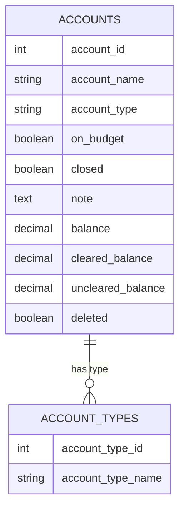

# ERD for the Finance DataWarehouse

```mermaid
erDiagram
    ACCOUNTS {
        int account_id
        string account_name
        string account_type
        boolean on_budget
        boolean closed
        text note
        decimal balance
        decimal cleared_balance
        decimal uncleared_balance
        boolean deleted
    }
    
    ACCOUNT_TYPES {
        int account_type_id
        string account_type_name
    }
    
    ACCOUNTS ||--o{ ACCOUNT_TYPES : "has type"
```