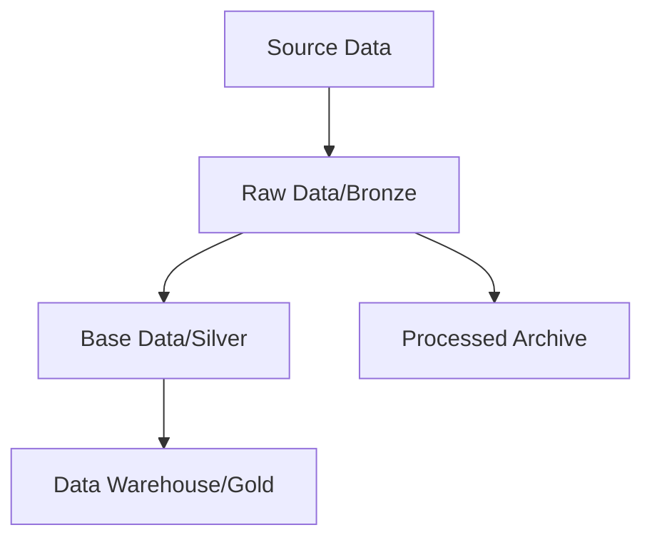

# Flow of data from source to gold

## Source

The Source Data is hosted in a web application called [You Need A Budget](https://www.youneedabudget.com/). We pull the data from the [YNAB API](https://api.ynab.com/),  using the access token method of authentication.  
The data is in JSON format.

## Raw Data/Bronze

The Raw Data is the data as it is pulled from the YNAB API. It is stored as JSON files in the `data/raw/` directory with a folder for each entity.

## Base Data/Silver

The Base Data is the data after it has been cleaned and transformed. It is stored as parquet files in the `data/base/` directory with a file for each entity.

## Data Warehouse/Gold

The Data Warehouse is the data after it has been aggregated and transformed. It is stored as parquet files in the `data/warehouse/` directory with a file for each entity.

## Processed Archive

The Processed Archive is the data after it has been processed and stored in the base tables. It is the raw json files in the `data/processed/` directory with a folder for each entity and file for each load that has been processed.

## Visualisation datasets

When preparing the data for visualisation, we create dataframes in memory that are used to create the visualisations. These are not stored on disk.
